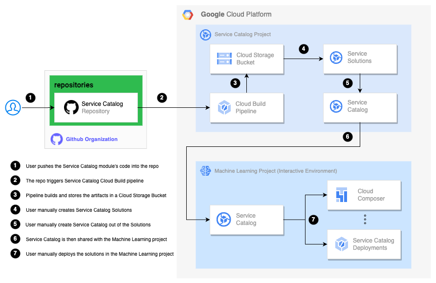

# The Service Catalog

## Overview

This repo provides a number of the [Google Service Catalog](https://cloud.google.com/service-catalog) Terraform-based solution modules:

<table>
<tbody>
<tr>
<td><a href="modules/artifact_registry/README.md">artifact_registry</a></td>
<td>Artifact Registry is the next generation of Container Registry. Store, manage, and secure your build artifacts.</td>
</tr>
<tr>
<td><a href="modules/bigquery/README.md">bigquery</a></td>
<td>BigQuery is a serverless and cost-effective enterprise data warehouse that works across clouds and scales with your data. Use built-in ML/AI and BI for insights at scale. </td>
</tr>
<tr>
<td><a href="modules/bucket/README.md">bucket</a></td>
<td>Cloud Storage is a managed service for storing unstructured data. </td>
</tr>
<tr>
<td><a href="modules/composer/README.md">composer</a></td>
<td>Cloud Composer is a fully managed workflow orchestration service built on Apache Airflow.</td>
</tr>
<tr>
<td><a href="modules/metadata/README.md">metadata</a></td>
<td>Vertex ML Metadata is a service that provides capabilities for managing the lifecycle of metadata consumed and produced by machine-learning (ML) workflows.</td>
</tr>
<tr>
<td><a href="modules/notebook/README.md">notebook</a></td>
<td>Vertex AI Workbench is a Jupyter notebook-based development environment for the entire data science workflow.</td>
</tr>
<tr>
<td><a href="modules/pubsub/README.md">pubsub</a></td>
<td>Pub/Sub is an asynchronous and scalable messaging service that decouples services producing messages from services processing those messages.</td>
</tr>
<tr>
<td><a href="modules/secrets/README.md">secrets</a></td>
<td>Secret Manager lets you store, manage, and access secrets as binary blobs or text strings. With the appropriate permissions, you can view the contents of the secret.</td>
</tr>
<tr>
<td><a href="modules/tensorboard/README.md">tensorboard</a></td>
<td>Vertex AI TensorBoard is an enterprise-ready managed service for machine learning experiment visualization.</td>
</tr>
</tbody>
</table>

## Building with Cloud Build

The Service Catalog solutions are built and published as artifacts to the Google Cloud Storage bucket with the Cloud Build CI/CD pipeline, in the `service-catalog` project in the `common`` environment, as per the diagram below:



The build is triggered by code push into the `service-catalog` Git (or Cloud Source Repositories). The pipeline builds the solution artifacts (one per module) and copies them into the Cloud Storage Bucket.

Once the modules are copied to the bucket, they can be used to create Terraform-based Solutions on the Service Catalog Admin page, see [Creating the configuration in Service Catalog](https://cloud.google.com/service-catalog/docs/terraform-configuration#create_config).

The Solutions then can be added to one or more [Service Catalogs](https://cloud.google.com/service-catalog/docs/create-catalog) and then [shared](https://cloud.google.com/service-catalog/docs/share-catalog) with the other projects to be used with the Service Catalog solution browser.

## Usage

### Google APIs

For the Service Catalog to be able to deploy the solution with the Cloud Build the following Google Cloud APIs should be enabled on the project:

```bash
aiplatform.googleapis.com
artifactregistry.googleapis.com
bigquery.googleapis.com
cloudkms.googleapis.com
composer.googleapis.com
compute.googleapis.com
container.googleapis.com
containerregistry.googleapis.com
dataflow.googleapis.com
dataform.googleapis.com
notebooks.googleapis.com
pubsub.googleapis.com
secretmanager.googleapis.com
storage.googleapis.com
```

### IAM Roles

To launch a solution using Service Catalog, user must have the following IAM roles assigned:

```bash
roles/cloudbuild.builds.editor
roles/storage.admin
roles/viewer
```

As well as the Cloud Build Service Agent `PROJECT_NUMBER@cloudbuild.gserviceaccount.com` show be granted the following IAM roles:

```bash
roles/aiplatform.admin
roles/artifactregistry.admin
roles/bigquery.admin
roles/cloudbuild.connectionAdmin
roles/composer.admin
roles/compute.admin
roles/compute.instanceAdmin.v1
roles/compute.networkAdmin
roles/iam.roleAdmin
roles/iam.serviceAccountAdmin
roles/iam.serviceAccountUser
roles/notebooks.admin
roles/pubsub.admin
roles/resourcemanager.projectIamAdmin
roles/secretmanager.admin
roles/serviceusage.serviceUsageConsumer
roles/storage.admin
```

Most of the Services deployed with the Service Catalog requires access to KMS service, to be able to encrypt data with the Customer Managed Encryption Key (CMEK), created as part of the project onboarding process. Hence, the Service Agent of the corresponding service requires the IAM role `roles/cloudkms.cryptoKeyEncrypterDecrypter` on the project's KMS key.

### Launch a Solution

In Service Catalog, you see a union of solutions from all the catalogs you have access to in your Google Cloud hierarchy.

To view available solutions, go to the Google Cloud console Service Catalog page. Solutions that have been shared with you appear in the main panel, see [Launch a Terraform configuration](https://cloud.google.com/service-catalog/docs/view-and-launch#launch_terraform) for more information.

## Resources

* [Service Catalog](https://cloud.google.com/service-catalog/docs)
* [Cloud Build](https://cloud.google.com/build/docs)
* [Cloud Storage](https://cloud.google.com/storage/docs)
* [Artifact Registry](https://cloud.google.com/artifact-registry/docs)
* [Big Query](https://cloud.google.com/bigquery/docs)
* [Cloud Composer](https://cloud.google.com/composer/docs)
* [Vertex ML Metadata](https://cloud.google.com/vertex-ai/docs/ml-metadata/introduction)
* [Vertex AI Workbench](https://cloud.google.com/vertex-ai/docs/workbench/introduction)
* [Pub/Sub](https://cloud.google.com/pubsub/docs)
* [Secret Manager](https://cloud.google.com/secret-manager/docs)
* [Vertex AI TensorBoard](https://cloud.google.com/vertex-ai/docs/experiments/tensorboard-introduction)
