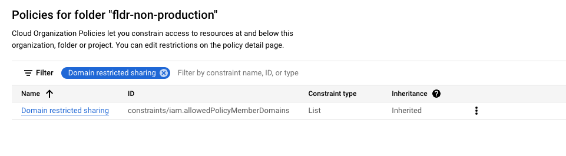
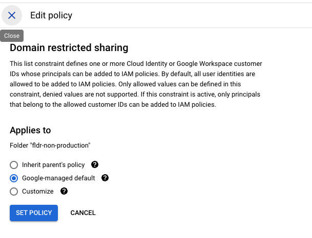

# Deploying on top of existing Foundation v.4.0.0

## Overview

To deploy a simple machine learning application, you must first have a [terraform-example-foundation v4.0.0](https://github.com/terraform-google-modules/terraform-example-foundation/tree/v4.0.0) instance set up. The following steps will guide you through the additional configurations required on top of the foundation.

## Requirements

### Code

- [terraform-example-foundation v4.0.0](https://github.com/terraform-google-modules/terraform-example-foundation/tree/v4.0.0) deployed until at least step `4-projects`.
- You must have role **Service Account User** (`roles/iam.serviceAccountUser`) on the [Terraform Service Accounts](https://github.com/terraform-google-modules/terraform-example-foundation/blob/master/docs/GLOSSARY.md#terraform-service-accounts) created in the foundation [Seed Project](https://github.com/terraform-google-modules/terraform-example-foundation/blob/master/docs/GLOSSARY.md#seed-project).
  The Terraform Service Accounts have the permissions to deploy each step of the foundation. Service Accounts:
  - `sa-terraform-bootstrap@<SEED_PROJECT_ID>.iam.gserviceaccount.com`.
  - `sa-terraform-env@<SEED_PROJECT_ID>.iam.gserviceaccount.com`
  - `sa-terraform-net@<SEED_PROJECT_ID>.iam.gserviceaccount.com`
  - `sa-terraform-proj@<SEED_PROJECT_ID>.iam.gserviceaccount.com`

### Software

Install the following dependencies:

- [Google Cloud SDK](https://cloud.google.com/sdk/install) version 469.0.0 or later.
- [Terraform](https://www.terraform.io/downloads.html) version 1.7.5 or later.

### Google Cloud SDK Configuration

Terraform must have Application Default Credentials configured, to configure it run:

```bash
gcloud auth application-default login
```

## Directory Layout and Terraform Initialization

For these instructions we assume that:

- The foundation was deployed using Cloud Build.
- Every repository, excluding the policies repositories, should be on the `production` branch and `terraform init` should be executed in each one.
- The following layout should exists in your local environment since you will need to make changes in these steps.
If you do not have this layout, please checkout the source repositories for the foundation steps following this layout.

    ```text
    gcp-bootstrap
    gcp-environments
    gcp-networks
    gcp-org
    gcp-policies
    gcp-policies-app-infra
    gcp-projects
    ```

- Also checkout the [terraform-google-enterprise-genai](https://github.com/GoogleCloudPlatform/terraform-google-enterprise-genai) repository at the same level.

The final layout should look like this:

```text
gcp-bootstrap
gcp-environments
gcp-networks
gcp-org
gcp-policies
gcp-policies-app-infra
gcp-projects
terraform-google-enterprise-genai
```

## Policies

### Update `gcloud terraform vet` policies

the first step is to update the `gcloud terraform vet` policies constraints to allow usage of the APIs needed by the Blueprint.
The constraints are located in the two policies repositories:

- `gcp-policies`
- `gcp-policies-app-infra`

All changes below must be made to both repositories:

Please note that the steps below are assuming you are checked out on `terraform-google-enterprise-genai/`.

- Copy `cmek_settings.yaml` from this repository to the policies repository:

``` bash
cp policy-library/policies/constraints/cmek_settings.yaml ../gcp-policies/policies/constraints/cmek_settings.yaml
```

- Copy `network_enable_firewall_logs.yaml` from this repository to the policies repository:

``` bash
cp policy-library/policies/constraints/network_enable_firewall_logs.yaml ../gcp-policies/policies/constraints/network_enable_firewall_logs.yaml
```

- Copy `require_dnssec.yaml` from this repository to the policies repository:

``` bash
cp policy-library/policies/constraints/require_dnssec.yaml ../gcp-policies/policies/constraints/require_dnssec.yaml
```

- Copy `storage_logging.yaml` from this repository to the policies repository:

``` bash
cp policy-library/policies/constraints/storage_logging.yaml ../gcp-policies/policies/constraints/storage_logging.yaml
```

- On `gcp-policies` and `gcp-policies-app-infra` change `serviceusage_allow_basic_apis.yaml` and add the following apis:

```yaml
     - "aiplatform.googleapis.com"
     - "bigquerymigration.googleapis.com"
     - "bigquerystorage.googleapis.com"
     - "containerregistry.googleapis.com"
     - "dataflow.googleapis.com"
     - "dataform.googleapis.com"
     - "deploymentmanager.googleapis.com"
     - "notebooks.googleapis.com"
     - "composer.googleapis.com"
     - "containerscanning.googleapis.com"
```

Add files to tracked on `gcp-policies` and `gcp-policies-app-infra` repositories, commit and push the code:

```bash
cd ../gcp-policies

git add policies/constraints/*.yaml
git commit -m "Add ML policies constraints"
git push origin $(git branch --show-current)

cd ../gcp-policie-app-infra

git add policies/constraints/*.yaml
git commit -m "Add ML policies constraints"
git push origin $(git branch --show-current)
```

## 1-org: Create Machine Learning Organization Policies and Organization Level Keys

This step corresponds to modifications made to `1-org` step on foundation.

Please note that the steps below are assuming you are checked out on `terraform-google-enterprise-genai/`

```bash
cd ../terraform-google-enterprise-genai
```

- Copy Machine Learning modules from this repo to `gcp-org` repository.

```bash
cp -r 1-org/modules/ml_kms_keyring ../gcp-org/modules
cp -r 1-org/modules/ml-org-policies ../gcp-org/modules
```

- Create `ml_ops_org_policy.tf` file on `gcp-org/envs/shared` path:

```bash
cp docs/assets/terraform/1-org/ml_ops_org_policy.tf ../gcp-org/envs/shared
```

- Create `ml_key_rings.tf` file on `gcp-org/envs/shared` path:

```bash
cp docs/assets/terraform/1-org/ml_key_rings.tf ../gcp-org/envs/shared
```

Add files to git on `gcp-org`, commit and push code:

```bash
cd ../gcp-org

git add envs/shared/ml_key_rings.tf
git add envs/shared/ml_ops_org_policy.tf
git add modules

git commit -m "Add ML org policies and Org-level key"
git push origin $(git branch --show-current)
```

## 2-environment: Create environment level logging keys, logging project and logging bucket

This step corresponds to modifications made to `2-environment` step on foundation.

Please note that the steps below are assuming you are checked out on `terraform-google-enterprise-genai/`.

```bash
cd ../terraform-google-enterprise-genai
```

### `development` branch

- Go to `gcp-environments` repository, and check out on `development` branch.

```bash
cd ../gcp-environemnts

git checkout development
```

- Return to `terraform-google-enterprise-genai` repo

```bash
cd ../terraform-google-enterprise-genai
```

- Copy Machine Learning modules from this repo to `gcp-environments` repository.

```bash
cp -r 2-environments/modules/ml_kms_keyring ../gcp-environments/modules
```

- Create `ml_key_rings.tf` file on `gcp-environments/modules/env_baseline` path:

```bash
cp docs/assets/terraform/2-environments/ml_key_rings.tf ../gcp-environments/modules/env_baseline
```

- Create `ml_logging.tf` file on `gcp-environments/modules/env_baseline` path:

```bash
cp docs/assets/terraform/2-environments/ml_logging.tf ../gcp-environments/modules/env_baseline
```

Commit and push files to git repo

```bash
git add .

git commit -m "Create env-level keys and env-level logging"

git push origin development
```

### `non-production` branch

- Go to `gcp-environments` repository, and check out on `non-production` branch.

```bash
cd ../gcp-environemnts

git checkout non-production
```

- Return to `terraform-google-enterprise-genai` repo

```bash
cd ../terraform-google-enterprise-genai
```

- Copy Machine Learning modules from this repo to `gcp-environments` repository.

```bash
cp -r 2-environments/modules/ml_kms_keyring ../gcp-environments/modules
```

- Create `ml_key_rings.tf` file on `gcp-environments/modules/env_baseline` path:

```bash
cp docs/assets/terraform/2-environments/ml_key_rings.tf ../gcp-environments/modules/env_baseline
```

- Create `ml_logging.tf` file on `gcp-environments/modules/env_baseline` path:

```bash
cp docs/assets/terraform/2-environments/ml_logging.tf ../gcp-environments/modules/env_baseline
```

Commit and push files to git repo

```bash
git add .

git commit -m "Create env-level keys and env-level logging"

git push origin non-production
```

### `production` branch

- Go to `gcp-environments` repository, and check out on `production` branch.

```bash
cd ../gcp-environemnts

git checkout production
```

- Return to `terraform-google-enterprise-genai` repo

```bash
cd ../terraform-google-enterprise-genai
```

- Copy Machine Learning modules from this repo to `gcp-environments` repository.

```bash
cp -r 2-environments/modules/ml_kms_keyring ../gcp-environments/modules
```

- Create `ml_key_rings.tf` file on `gcp-environments/modules/env_baseline` path:

```bash
cp docs/assets/terraform/2-environments/ml_key_rings.tf ../gcp-environments/modules/env_baseline
```

- Create `ml_logging.tf` file on `gcp-environments/modules/env_baseline` path:

```bash
cp docs/assets/terraform/2-environments/ml_logging.tf ../gcp-environments/modules/env_baseline
```

Commit and push files to git repo

```bash
git add .

git commit -m "Create env-level keys and env-level logging"

git push origin production
```

### `N.B.` Read this before continuing further

A logging project will be created in every environment (`development`, `non-production`, `production`) when running this code. This project contains a storage bucket for the purposes of project logging within its respective environment.  This requires the `cloud-storage-analytics@google.com` group permissions for the storage bucket.  Since foundations has more restricted security measures, a domain restriction constraint is enforced.  This restraint will prevent the google cloud-storage-analytics group to be added to any permissions.  In order for this terraform code to execute without error, manual intervention must be made to ensure everything applies without issue.

You must disable the contraint, assign the permission on the bucket and then apply the contraint again. This step-by-step presents you with two different options and only one of them should be executed.

The first and the recommended option is making the intervention using `gcloud` cli, as described in **Option 1**.

**Option 2** is an alternative to `gcloud` cli and relies on Google Cloud Console.

#### Option 1: Use `gcloud` cli to disable/enable organization policy constraint

You will be doing this procedure for each environment (`development`, `non-production` & `production`)

##### `development` environment configuration

1. Configure the following variable below with the value of `gcp-environments` repository path.

    ```bash
    export GCP_ENVIRONMENTS_PATH=INSERT_YOUR_PATH_HERE
    ```

    Make sure your git is checked out to the development branch by running `git checkout development` on `GCP_ENVIRONMENTS_PATH`.

    ```bash
    (cd $GCP_ENVIRONMENTS_PATH && git checkout development)
    ```

2. Retrieve the bucket name and project id from terraform outputs.

    ```bash
    export ENV_LOG_BUCKET_NAME=$(terraform -chdir="$GCP_ENVIRONMENTS_PATH/envs/development" output -raw env_log_bucket_name)
    export ENV_LOG_PROJECT_ID=$(terraform -chdir="$GCP_ENVIRONMENTS_PATH/envs/development" output -raw env_log_project_id)
    ```

3. Validate the variable values.

    ```bash
    echo env_log_project_id=$ENV_LOG_PROJECT_ID
    echo env_log_bucket_name=$ENV_LOG_BUCKET_NAME
    ```

4. Reset your org policy for the logging project by running the following command.

    ```bash
    gcloud org-policies reset iam.allowedPolicyMemberDomains --project=$ENV_LOG_PROJECT_ID
    ```

5. Assign `roles/storage.objectCreator` role to `cloud-storage-analytics@google.com` group.

    ```bash
    gcloud storage buckets add-iam-policy-binding gs://$ENV_LOG_BUCKET_NAME --member="group:cloud-storage-analytics@google.com" --role="roles/storage.objectCreator"
    ```

    > Note: you might receive an error telling you that this is against an organization policy, this can happen because of the propagation time from the change made to the organization policy (propagation time is tipically 2 minutes, but can take 7 minutes or longer). If this happens, wait some minutes and try again

6. Delete the change made on the first step to the organization policy, this will make the project inherit parent policies.

    ```bash
    gcloud org-policies delete iam.allowedPolicyMemberDomains --project=$ENV_LOG_PROJECT_ID
    ```

##### `non-production` environment configuration

1. Configure the following variable below with the value of `gcp-environments` repository path.

    ```bash
    export GCP_ENVIRONMENTS_PATH=INSERT_YOUR_PATH_HERE
    ```

    Make sure your git is checked out to the `non-production` branch by running `git checkout non-production` on `GCP_ENVIRONMENTS_PATH`.

    ```bash
    (cd $GCP_ENVIRONMENTS_PATH && git checkout non-production)
    ```

2. Retrieve the bucket name and project id from terraform outputs.

    ```bash
    export ENV_LOG_BUCKET_NAME=$(terraform -chdir="$GCP_ENVIRONMENTS_PATH/envs/non-production" output -raw env_log_bucket_name)
    export ENV_LOG_PROJECT_ID=$(terraform -chdir="$GCP_ENVIRONMENTS_PATH/envs/non-production" output -raw env_log_project_id)
    ```

3. Validate the variable values.

    ```bash
    echo env_log_project_id=$ENV_LOG_PROJECT_ID
    echo env_log_bucket_name=$ENV_LOG_BUCKET_NAME
    ```

4. Reset your org policy for the logging project by running the following command.

    ```bash
    gcloud org-policies reset iam.allowedPolicyMemberDomains --project=$ENV_LOG_PROJECT_ID
    ```

5. Assign `roles/storage.objectCreator` role to `cloud-storage-analytics@google.com` group.

    ```bash
    gcloud storage buckets add-iam-policy-binding gs://$ENV_LOG_BUCKET_NAME --member="group:cloud-storage-analytics@google.com" --role="roles/storage.objectCreator"
    ```

    > Note: you might receive an error telling you that this is against an organization policy, this can happen because of the propagation time from the change made to the organization policy (propagation time is tipically 2 minutes, but can take 7 minutes or longer). If this happens, wait some minutes and try again

6. Delete the change made on the first step to the organization policy, this will make the project inherit parent policies.

    ```bash
    gcloud org-policies delete iam.allowedPolicyMemberDomains --project=$ENV_LOG_PROJECT_ID
    ```

##### `production` environment configuration

1. Configure the following variable below with the value of `gcp-environments` repository path.

    ```bash
    export GCP_ENVIRONMENTS_PATH=INSERT_YOUR_PATH_HERE
    ```

    Make sure your git is checked out to the `production` branch by running `git checkout production` on `GCP_ENVIRONMENTS_PATH`.

    ```bash
    (cd $GCP_ENVIRONMENTS_PATH && git checkout production)
    ```

2. Retrieve the bucket name and project id from terraform outputs.

    ```bash
    export ENV_LOG_BUCKET_NAME=$(terraform -chdir="$GCP_ENVIRONMENTS_PATH/envs/production" output -raw env_log_bucket_name)
    export ENV_LOG_PROJECT_ID=$(terraform -chdir="$GCP_ENVIRONMENTS_PATH/envs/production" output -raw env_log_project_id)
    ```

3. Validate the variable values.

    ```bash
    echo env_log_project_id=$ENV_LOG_PROJECT_ID
    echo env_log_bucket_name=$ENV_LOG_BUCKET_NAME
    ```

4. Reset your org policy for the logging project by running the following command.

    ```bash
    gcloud org-policies reset iam.allowedPolicyMemberDomains --project=$ENV_LOG_PROJECT_ID
    ```

5. Assign `roles/storage.objectCreator` role to `cloud-storage-analytics@google.com` group.

    ```bash
    gcloud storage buckets add-iam-policy-binding gs://$ENV_LOG_BUCKET_NAME --member="group:cloud-storage-analytics@google.com" --role="roles/storage.objectCreator"
    ```

    > Note: you might receive an error telling you that this is against an organization policy, this can happen because of the propagation time from the change made to the organization policy (propagation time is tipically 2 minutes, but can take 7 minutes or longer). If this happens, wait some minutes and try again

6. Delete the change made on the first step to the organization policy, this will make the project inherit parent policies.

    ```bash
    gcloud org-policies delete iam.allowedPolicyMemberDomains --project=$ENV_LOG_PROJECT_ID
    ```

#### Option 2: Use Google Cloud Console to disable/enable organization policy constraint

1. On `ml_logging.tf` locate the following lines and uncomment them:

    ```terraform
    resource "google_storage_bucket_iam_member" "bucket_logging" {
      bucket = google_storage_bucket.log_bucket.name
      role   = "roles/storage.objectCreator"
      member = "group:cloud-storage-analytics@google.com"
    }
    ```

2. Under `IAM & Admin`, select `Organization Policies`.  Search for "Domain Restricted Sharing".

    

3. Select 'Manage Policy'.  This directs you to the Domain Restricted Sharing Edit Policy page.  It will be set at 'Inherit parent's policy'.  Change this to 'Google-managed default'.

    

4. Follow the instructions on checking out `development`, `non-production` & `production` branches. Once environments terraform code has successfully applied, edit the policy again and select 'Inherit parent's policy' and Click `SET POLICY`.

After making these modifications, you can follow the README.md procedure for `2-environment` step on foundation, make sure you **change the organization policy after running the steps on foundation**.

## 3-network: Configure private DNS zone for Vertex Workbench Instances, Enable NAT and Attach projects to perimeter

This step corresponds to modifications made to `3-networks-dual-svpc` step on foundation.

Please note that the steps below are assuming you are checked out on `terraform-google-enterprise-genai/`.

```bash
cd ../terraform-google-enterprise-genai
```

### `development` branch on `gcp-networks`

- Go to `gcp-networks` repository, and check out on `development` branch.

```bash
cd ../gcp-networks

git checkout development
```

#### Private DNS zone configuration (dev)

- Return to `terraform-google-enterprise-genai` repo

```bash
cd ../terraform-google-enterprise-genai
```

- Copy DNS notebook network module from this repo to `gcp-networks` repository.

```bash
cp -r 3-networks-dual-svpc/modules/ml_dns_notebooks ../gcp-networks/modules
```

- Create a file named `ml_dns_notebooks.tf` on path `gcp-networks/modules/base_env`:

```bash
cp docs/assets/terraform/3-networks-dual-svpc/ml_dns_notebooks.tf ../gcp-networks/modules/base_env
```

Commit and push files to git repo

```bash
git add .

git commit -m "Create DNS notebook configuration"

git push origin development
```

#### Enabling NAT, Attaching projects to Service Perimeter and Creating custom firewall rules (dev)

Create `gcp-networks/modules/base_env/data.tf` file with the following content:

```terraform
/**
 * Copyright 2024 Google LLC
 *
 * Licensed under the Apache License, Version 2.0 (the "License");
 * you may not use this file except in compliance with the License.
 * You may obtain a copy of the License at
 *
 *      http://www.apache.org/licenses/LICENSE-2.0
 *
 * Unless required by applicable law or agreed to in writing, software
 * distributed under the License is distributed on an "AS IS" BASIS,
 * WITHOUT WARRANTIES OR CONDITIONS OF ANY KIND, either express or implied.
 * See the License for the specific language governing permissions and
 * limitations under the License.
 */


data "google_netblock_ip_ranges" "legacy_health_checkers" {
  range_type = "legacy-health-checkers"
}

data "google_netblock_ip_ranges" "health_checkers" {
  range_type = "health-checkers"
}

// Cloud IAP's TCP forwarding netblock
data "google_netblock_ip_ranges" "iap_forwarders" {
  range_type = "iap-forwarders"
}
```

On `gcp-networks/modules/restricted_shared_vpc/variables.tf` add the following variables:

```terraform
variable "perimeter_projects" {
  description = "A list of project numbers to be added to the service perimeter"
  type        = list(number)
  default     = []
}

variable "allow_all_egress_ranges" {
  description = "List of network ranges to which all egress traffic will be allowed"
  default     = null
}

variable "allow_all_ingress_ranges" {
  description = "List of network ranges from which all ingress traffic will be allowed"
  default     = null
}
```

On `gcp-networks/modules/base_env/remote.tf`:

1. Add the env remote state, by adding the following terraform code to the file:

    ```terraform
    data "terraform_remote_state" "env" {
      backend = "gcs"

      config = {
        bucket = var.remote_state_bucket
        prefix = "terraform/environments/${var.env}"
      }
    }
    ```

2. Edit `locals` and add the following fields:

    ```terraform
    logging_env_project_number   = data.terraform_remote_state.env.outputs.env_log_project_number
    kms_env_project_number       = data.terraform_remote_state.env.outputs.env_kms_project_number
    ```

3. The final result will contain existing locals and the added ones, it should look similar to the code below:

    ```terraform
    locals {
      restricted_project_id        = data.terraform_remote_state.org.outputs.shared_vpc_projects[var.env].restricted_shared_vpc_project_id
      restricted_project_number    = data.terraform_remote_state.org.outputs.shared_vpc_projects[var.env].restricted_shared_vpc_project_number
      base_project_id              = data.terraform_remote_state.org.outputs.shared_vpc_projects[var.env].base_shared_vpc_project_id
      interconnect_project_number  = data.terraform_remote_state.org.outputs.interconnect_project_number
      dns_hub_project_id           = data.terraform_remote_state.org.outputs.dns_hub_project_id
      organization_service_account = data.terraform_remote_state.bootstrap.outputs.organization_step_terraform_service_account_email
      networks_service_account     = data.terraform_remote_state.bootstrap.outputs.networks_step_terraform_service_account_email
      projects_service_account     = data.terraform_remote_state.bootstrap.outputs.projects_step_terraform_service_account_email
      logging_env_project_number   = data.terraform_remote_state.env.outputs.env_log_project_number
      kms_env_project_number       = data.terraform_remote_state.env.outputs.env_kms_project_number
    }
    ```

##### Adding projects to service perimeter (dev)

On `gcp-networks/modules/restricted_shared_vpc/service_control.tf`, modify the terraform module called **regular_service_perimeter** and add the following module field to `resources`:

```terraform
distinct(concat([var.project_number], var.perimeter_projects))
```

This shall result in a module similar to the code below:

```terraform
module "regular_service_perimeter" {
  source  = "terraform-google-modules/vpc-service-controls/google//modules/regular_service_perimeter"
  version = "~> 4.0"

  policy         = var.access_context_manager_policy_id
  perimeter_name = local.perimeter_name
  description    = "Default VPC Service Controls perimeter"
  resources      = distinct(concat([var.project_number], var.perimeter_projects))
  access_levels  = [module.access_level_members.name]

  restricted_services     = var.restricted_services
  vpc_accessible_services = ["RESTRICTED-SERVICES"]

  ingress_policies = var.ingress_policies
  egress_policies  = var.egress_policies

  depends_on = [
    time_sleep.wait_vpc_sc_propagation
  ]
}
```

##### Creating "allow all ingress ranges" and "allow all egress ranges" firewall rules (dev)

On `gcp-networks/modules/restricted_shared_vpc/firewall.tf` add the following firewall rules by adding the terraform code below to the file:

```terraform
resource "google_compute_firewall" "allow_all_egress" {
  count = var.allow_all_egress_ranges != null ? 1 : 0

  name      = "fw-${var.environment_code}-shared-base-1000-e-a-all-all-all"
  network   = module.main.network_name
  project   = var.project_id
  direction = "EGRESS"
  priority  = 1000

  dynamic "log_config" {
    for_each = var.firewall_enable_logging == true ? [{
      metadata = "INCLUDE_ALL_METADATA"
    }] : []

    content {
      metadata = log_config.value.metadata
    }
  }

  allow {
    protocol = "all"
  }

  destination_ranges = var.allow_all_egress_ranges
}

resource "google_compute_firewall" "allow_all_ingress" {
  count = var.allow_all_ingress_ranges != null ? 1 : 0

  name      = "fw-${var.environment_code}-shared-base-1000-i-a-all"
  network   = module.main.network_name
  project   = var.project_id
  direction = "INGRESS"
  priority  = 1000

  dynamic "log_config" {
    for_each = var.firewall_enable_logging == true ? [{
      metadata = "INCLUDE_ALL_METADATA"
    }] : []

    content {
      metadata = log_config.value.metadata
    }
  }

  allow {
    protocol = "all"
  }

  source_ranges = var.allow_all_ingress_ranges
}
```

##### Changes to restricted shared VPC (dev)

On `gcp-networks/modules/base_env/main.tf` edit the terraform module named **restricted_shared_vpc** and add the following fields to it:

```terraform
allow_all_ingress_ranges = concat(data.google_netblock_ip_ranges.health_checkers.cidr_blocks_ipv4, data.google_netblock_ip_ranges.legacy_health_checkers.cidr_blocks_ipv4, data.google_netblock_ip_ranges.iap_forwarders.cidr_blocks_ipv4)
allow_all_egress_ranges  = ["0.0.0.0/0"]

nat_enabled               = true
nat_num_addresses_region1 = 1
nat_num_addresses_region2 = 1

perimeter_projects = [local.logging_env_project_number, local.kms_env_project_number]
```

Commit all changes and push to the current branch

```bash
git add .
git commit -m "Create custom fw rules, enable nat, configure dns and service perimeter"

git push origin development
```

### `non-production` branch on `gcp-networks`

- Go to `gcp-networks` repository, and check out on `non-production` branch.

```bash
cd ../gcp-networks

git checkout non-production
```

#### Private DNS zone configuration (non-prod)

- Return to `terraform-google-enterprise-genai` repo

```bash
cd ../terraform-google-enterprise-genai
```

- Copy DNS notebook network module from this repo to `gcp-networks` repository.

```bash
cp -r 3-networks-dual-svpc/modules/ml_dns_notebooks ../gcp-networks/modules
```

- Create a file named `ml_dns_notebooks.tf` on path `gcp-networks/modules/base_env`:

```bash
cp docs/assets/terraform/3-networks-dual-svpc/ml_dns_notebooks.tf ../gcp-networks/modules/base_env
```

Commit and push files to git repo

```bash
git add .

git commit -m "Create DNS notebook configuration"

git push origin non-production
```

#### Enabling NAT, Attaching projects to Service Perimeter and Creating custom firewall rules (non-prod)

Create `gcp-networks/modules/base_env/data.tf` file with the following content:

```terraform
/**
 * Copyright 2024 Google LLC
 *
 * Licensed under the Apache License, Version 2.0 (the "License");
 * you may not use this file except in compliance with the License.
 * You may obtain a copy of the License at
 *
 *      http://www.apache.org/licenses/LICENSE-2.0
 *
 * Unless required by applicable law or agreed to in writing, software
 * distributed under the License is distributed on an "AS IS" BASIS,
 * WITHOUT WARRANTIES OR CONDITIONS OF ANY KIND, either express or implied.
 * See the License for the specific language governing permissions and
 * limitations under the License.
 */


data "google_netblock_ip_ranges" "legacy_health_checkers" {
  range_type = "legacy-health-checkers"
}

data "google_netblock_ip_ranges" "health_checkers" {
  range_type = "health-checkers"
}

// Cloud IAP's TCP forwarding netblock
data "google_netblock_ip_ranges" "iap_forwarders" {
  range_type = "iap-forwarders"
}
```

On `gcp-networks/modules/restricted_shared_vpc/variables.tf` add the following variables:

```terraform
variable "perimeter_projects" {
  description = "A list of project numbers to be added to the service perimeter"
  type        = list(number)
  default     = []
}

variable "allow_all_egress_ranges" {
  description = "List of network ranges to which all egress traffic will be allowed"
  default     = null
}

variable "allow_all_ingress_ranges" {
  description = "List of network ranges from which all ingress traffic will be allowed"
  default     = null
}
```

On `gcp-networks/modules/base_env/remote.tf`:

1. Add the env remote state, by adding the following terraform code to the file:

    ```terraform
    data "terraform_remote_state" "env" {
      backend = "gcs"

      config = {
        bucket = var.remote_state_bucket
        prefix = "terraform/environments/${var.env}"
      }
    }
    ```

2. Edit `locals` and add the following fields:

    ```terraform
    logging_env_project_number   = data.terraform_remote_state.env.outputs.env_log_project_number
    kms_env_project_number       = data.terraform_remote_state.env.outputs.env_kms_project_number
    ```

3. The final result will contain existing locals and the added ones, it should look similar to the code below:

    ```terraform
    locals {
      restricted_project_id        = data.terraform_remote_state.org.outputs.shared_vpc_projects[var.env].restricted_shared_vpc_project_id
      restricted_project_number    = data.terraform_remote_state.org.outputs.shared_vpc_projects[var.env].restricted_shared_vpc_project_number
      base_project_id              = data.terraform_remote_state.org.outputs.shared_vpc_projects[var.env].base_shared_vpc_project_id
      interconnect_project_number  = data.terraform_remote_state.org.outputs.interconnect_project_number
      dns_hub_project_id           = data.terraform_remote_state.org.outputs.dns_hub_project_id
      organization_service_account = data.terraform_remote_state.bootstrap.outputs.organization_step_terraform_service_account_email
      networks_service_account     = data.terraform_remote_state.bootstrap.outputs.networks_step_terraform_service_account_email
      projects_service_account     = data.terraform_remote_state.bootstrap.outputs.projects_step_terraform_service_account_email
      logging_env_project_number   = data.terraform_remote_state.env.outputs.env_log_project_number
      kms_env_project_number       = data.terraform_remote_state.env.outputs.env_kms_project_number
    }
    ```

##### Adding projects to service perimeter (non-prod)

On `gcp-networks/modules/restricted_shared_vpc/service_control.tf`, modify the terraform module called **regular_service_perimeter** and add the following module field to `resources`:

```terraform
distinct(concat([var.project_number], var.perimeter_projects))
```

This shall result in a module similar to the code below:

```terraform
module "regular_service_perimeter" {
  source  = "terraform-google-modules/vpc-service-controls/google//modules/regular_service_perimeter"
  version = "~> 4.0"

  policy         = var.access_context_manager_policy_id
  perimeter_name = local.perimeter_name
  description    = "Default VPC Service Controls perimeter"
  resources      = distinct(concat([var.project_number], var.perimeter_projects))
  access_levels  = [module.access_level_members.name]

  restricted_services     = var.restricted_services
  vpc_accessible_services = ["RESTRICTED-SERVICES"]

  ingress_policies = var.ingress_policies
  egress_policies  = var.egress_policies

  depends_on = [
    time_sleep.wait_vpc_sc_propagation
  ]
}
```

##### Creating "allow all ingress ranges" and "allow all egress ranges" firewall rules (non-prod)

On `gcp-networks/modules/restricted_shared_vpc/firewall.tf` add the following firewall rules by adding the terraform code below to the file:

```terraform
resource "google_compute_firewall" "allow_all_egress" {
  count = var.allow_all_egress_ranges != null ? 1 : 0

  name      = "fw-${var.environment_code}-shared-base-1000-e-a-all-all-all"
  network   = module.main.network_name
  project   = var.project_id
  direction = "EGRESS"
  priority  = 1000

  dynamic "log_config" {
    for_each = var.firewall_enable_logging == true ? [{
      metadata = "INCLUDE_ALL_METADATA"
    }] : []

    content {
      metadata = log_config.value.metadata
    }
  }

  allow {
    protocol = "all"
  }

  destination_ranges = var.allow_all_egress_ranges
}

resource "google_compute_firewall" "allow_all_ingress" {
  count = var.allow_all_ingress_ranges != null ? 1 : 0

  name      = "fw-${var.environment_code}-shared-base-1000-i-a-all"
  network   = module.main.network_name
  project   = var.project_id
  direction = "INGRESS"
  priority  = 1000

  dynamic "log_config" {
    for_each = var.firewall_enable_logging == true ? [{
      metadata = "INCLUDE_ALL_METADATA"
    }] : []

    content {
      metadata = log_config.value.metadata
    }
  }

  allow {
    protocol = "all"
  }

  source_ranges = var.allow_all_ingress_ranges
}
```

##### Changes to restricted shared VPC (non-prod)

On `gcp-networks/modules/base_env/main.tf` edit the terraform module named **restricted_shared_vpc** and add the following fields to it:

```terraform
allow_all_ingress_ranges = concat(data.google_netblock_ip_ranges.health_checkers.cidr_blocks_ipv4, data.google_netblock_ip_ranges.legacy_health_checkers.cidr_blocks_ipv4, data.google_netblock_ip_ranges.iap_forwarders.cidr_blocks_ipv4)
allow_all_egress_ranges  = ["0.0.0.0/0"]

nat_enabled               = true
nat_num_addresses_region1 = 1
nat_num_addresses_region2 = 1

perimeter_projects = [local.logging_env_project_number, local.kms_env_project_number]
```

Commit all changes and push to the current branch

```bash
git add .
git commit -m "Create custom fw rules, enable nat, configure dns and service perimeter"

git push origin non-production
```

### `production` branch on `gcp-networks`

- Go to `gcp-networks` repository, and check out on `production` branch.

```bash
cd ../gcp-networks

git checkout production
```

#### Private DNS zone configuration (prod)

- Return to `terraform-google-enterprise-genai` repo

```bash
cd ../terraform-google-enterprise-genai
```

- Copy DNS notebook network module from this repo to `gcp-networks` repository.

```bash
cp -r 3-networks-dual-svpc/modules/ml_dns_notebooks ../gcp-networks/modules
```

- Create a file named `ml_dns_notebooks.tf` on path `gcp-networks/modules/base_env`:

```bash
cp docs/assets/terraform/3-networks-dual-svpc/ml_dns_notebooks.tf ../gcp-networks/modules/base_env
```

Commit and push files to git repo

```bash
git add .

git commit -m "Create DNS notebook configuration"

git push origin production
```

#### Enabling NAT, Attaching projects to Service Perimeter and Creating custom firewall rules (prod)

Create `gcp-networks/modules/base_env/data.tf` file with the following content:

```terraform
/**
 * Copyright 2024 Google LLC
 *
 * Licensed under the Apache License, Version 2.0 (the "License");
 * you may not use this file except in compliance with the License.
 * You may obtain a copy of the License at
 *
 *      http://www.apache.org/licenses/LICENSE-2.0
 *
 * Unless required by applicable law or agreed to in writing, software
 * distributed under the License is distributed on an "AS IS" BASIS,
 * WITHOUT WARRANTIES OR CONDITIONS OF ANY KIND, either express or implied.
 * See the License for the specific language governing permissions and
 * limitations under the License.
 */


data "google_netblock_ip_ranges" "legacy_health_checkers" {
  range_type = "legacy-health-checkers"
}

data "google_netblock_ip_ranges" "health_checkers" {
  range_type = "health-checkers"
}

// Cloud IAP's TCP forwarding netblock
data "google_netblock_ip_ranges" "iap_forwarders" {
  range_type = "iap-forwarders"
}
```

On `gcp-networks/modules/restricted_shared_vpc/variables.tf` add the following variables:

```terraform
variable "perimeter_projects" {
  description = "A list of project numbers to be added to the service perimeter"
  type        = list(number)
  default     = []
}

variable "allow_all_egress_ranges" {
  description = "List of network ranges to which all egress traffic will be allowed"
  default     = null
}

variable "allow_all_ingress_ranges" {
  description = "List of network ranges from which all ingress traffic will be allowed"
  default     = null
}
```

On `gcp-networks/modules/base_env/remote.tf`:

1. Add the env remote state, by adding the following terraform code to the file:

    ```terraform
    data "terraform_remote_state" "env" {
      backend = "gcs"

      config = {
        bucket = var.remote_state_bucket
        prefix = "terraform/environments/${var.env}"
      }
    }
    ```

2. Edit `locals` and add the following fields:

    ```terraform
    logging_env_project_number   = data.terraform_remote_state.env.outputs.env_log_project_number
    kms_env_project_number       = data.terraform_remote_state.env.outputs.env_kms_project_number
    ```

3. The final result will contain existing locals and the added ones, it should look similar to the code below:

    ```terraform
    locals {
      restricted_project_id        = data.terraform_remote_state.org.outputs.shared_vpc_projects[var.env].restricted_shared_vpc_project_id
      restricted_project_number    = data.terraform_remote_state.org.outputs.shared_vpc_projects[var.env].restricted_shared_vpc_project_number
      base_project_id              = data.terraform_remote_state.org.outputs.shared_vpc_projects[var.env].base_shared_vpc_project_id
      interconnect_project_number  = data.terraform_remote_state.org.outputs.interconnect_project_number
      dns_hub_project_id           = data.terraform_remote_state.org.outputs.dns_hub_project_id
      organization_service_account = data.terraform_remote_state.bootstrap.outputs.organization_step_terraform_service_account_email
      networks_service_account     = data.terraform_remote_state.bootstrap.outputs.networks_step_terraform_service_account_email
      projects_service_account     = data.terraform_remote_state.bootstrap.outputs.projects_step_terraform_service_account_email
      logging_env_project_number   = data.terraform_remote_state.env.outputs.env_log_project_number
      kms_env_project_number       = data.terraform_remote_state.env.outputs.env_kms_project_number
    }
    ```

##### Adding projects to service perimeter (prod)

On `gcp-networks/modules/restricted_shared_vpc/service_control.tf`, modify the terraform module called **regular_service_perimeter** and add the following module field to `resources`:

```terraform
distinct(concat([var.project_number], var.perimeter_projects))
```

This shall result in a module similar to the code below:

```terraform
module "regular_service_perimeter" {
  source  = "terraform-google-modules/vpc-service-controls/google//modules/regular_service_perimeter"
  version = "~> 4.0"

  policy         = var.access_context_manager_policy_id
  perimeter_name = local.perimeter_name
  description    = "Default VPC Service Controls perimeter"
  resources      = distinct(concat([var.project_number], var.perimeter_projects))
  access_levels  = [module.access_level_members.name]

  restricted_services     = var.restricted_services
  vpc_accessible_services = ["RESTRICTED-SERVICES"]

  ingress_policies = var.ingress_policies
  egress_policies  = var.egress_policies

  depends_on = [
    time_sleep.wait_vpc_sc_propagation
  ]
}
```

##### Creating "allow all ingress ranges" and "allow all egress ranges" firewall rules (prod)

On `gcp-networks/modules/restricted_shared_vpc/firewall.tf` add the following firewall rules by adding the terraform code below to the file:

```terraform
resource "google_compute_firewall" "allow_all_egress" {
  count = var.allow_all_egress_ranges != null ? 1 : 0

  name      = "fw-${var.environment_code}-shared-base-1000-e-a-all-all-all"
  network   = module.main.network_name
  project   = var.project_id
  direction = "EGRESS"
  priority  = 1000

  dynamic "log_config" {
    for_each = var.firewall_enable_logging == true ? [{
      metadata = "INCLUDE_ALL_METADATA"
    }] : []

    content {
      metadata = log_config.value.metadata
    }
  }

  allow {
    protocol = "all"
  }

  destination_ranges = var.allow_all_egress_ranges
}

resource "google_compute_firewall" "allow_all_ingress" {
  count = var.allow_all_ingress_ranges != null ? 1 : 0

  name      = "fw-${var.environment_code}-shared-base-1000-i-a-all"
  network   = module.main.network_name
  project   = var.project_id
  direction = "INGRESS"
  priority  = 1000

  dynamic "log_config" {
    for_each = var.firewall_enable_logging == true ? [{
      metadata = "INCLUDE_ALL_METADATA"
    }] : []

    content {
      metadata = log_config.value.metadata
    }
  }

  allow {
    protocol = "all"
  }

  source_ranges = var.allow_all_ingress_ranges
}
```

##### Changes to restricted shared VPC (prod)

On `gcp-networks/modules/base_env/main.tf` edit the terraform module named **restricted_shared_vpc** and add the following fields to it:

```terraform
allow_all_ingress_ranges = concat(data.google_netblock_ip_ranges.health_checkers.cidr_blocks_ipv4, data.google_netblock_ip_ranges.legacy_health_checkers.cidr_blocks_ipv4, data.google_netblock_ip_ranges.iap_forwarders.cidr_blocks_ipv4)
allow_all_egress_ranges  = ["0.0.0.0/0"]

nat_enabled               = true
nat_num_addresses_region1 = 1
nat_num_addresses_region2 = 1

perimeter_projects = [local.logging_env_project_number, local.kms_env_project_number]
```

Commit all changes and push to the current branch

```bash
git add .
git commit -m "Create custom fw rules, enable nat, configure dns and service perimeter"

git push origin production
```

## 4-projects: Create Service Catalog and Artifacts Shared projects and Machine Learning Projects

This step corresponds to modifications made to `4-projects` step on foundation.

Please note that the steps below are assuming you are checked out on `terraform-google-enterprise-genai/`.

```bash
cd ../terraform-google-enterprise-genai
```

In this tutorial, we are using `ml_business_unit` as an example.

You need to manually plan and apply only once the `ml_business_unit/shared`.

### Manually applying `shared`

- Go to `gcp-projects` repository and checkout to `plan` branch.

```bash
cd ../gcp-projects

git checkout -plan
```

- Return to GenAI repository

```bash
cd ../terraform-google-enterprise-genai
```

- Copy `ml_business_unit` to the `gcp-projects` repository.

```bash
cp -r docs/assets/terraform/4-projects/ml_business_unit ../gcp-projects
```

- Add modules to the `gcp-projects` repository.

```bash
cp -r docs/assets/terraform/4-projects/modules/* ../gcp-projects/modules
```

- Go to `gcp-projects` repository.

```bash
cd ../gcp-projects
```

- Update project backend by retrieving it's value from `0-bootstrap` and applying it to `backend.tf`.

```bash
export PROJECT_BACKEND=$(terraform -chdir="../gcp-bootstrap/envs/shared" output -raw projects_gcs_bucket_tfstate)

for file in $(find . -name backend.tf); do sed -i "s/UPDATE_PROJECTS_BACKEND/$PROJECT_BACKEND/" $file; done
```

- Retrieve projects step service account e-mail.

```bash
export GOOGLE_IMPERSONATE_SERVICE_ACCOUNT=$(terraform -chdir="../gcp-bootstrap/envs/shared" output -raw projects_step_terraform_service_account_email)
echo ${GOOGLE_IMPERSONATE_SERVICE_ACCOUNT}
```

- Retrieve cloud build project id

```bash
export CLOUD_BUILD_PROJECT_ID=$(terraform -chdir="../gcp-bootstrap/envs/shared" output -raw cloudbuild_project_id)
echo ${CLOUD_BUILD_PROJECT_ID}
```

- Log into gcloud using service account impersonation and then set your configuration:

```bash
gcloud auth application-default login --impersonate-service-account=${GOOGLE_IMPERSONATE_SERVICE_ACCOUNT}
```

- Run `init` and `plan` and review output for environment shared.

```bash
./tf-wrapper.sh init shared
./tf-wrapper.sh plan shared
```

- Run `validate` and check for violations.

```bash
./tf-wrapper.sh validate shared $(pwd)/../gcp-policies ${CLOUD_BUILD_PROJECT_ID}
```

- Run `apply` shared.

```bash
./tf-wrapper.sh apply shared
```

This will create the artifacts and service catalog projects under `common` folder and configure the Machine Learning business unit infra pipeline.

### `development` branch on `gcp-projects`

This will create the machine learning development environment. A Machine Learning project will be hosted under a folder.

## 5-appinfra

- create service catalog and artifacts build triggers
- trigger service catalog and artifacts custom builds
- adjust vpc-sc to your environment

## 6-mlpipeline

- trigger ml infra pipeline, which will create some resources on development environment for the machine learning project
- on dev env run the notebook and adjust it to your environment
- promote the test application to prod and test the deployed model
